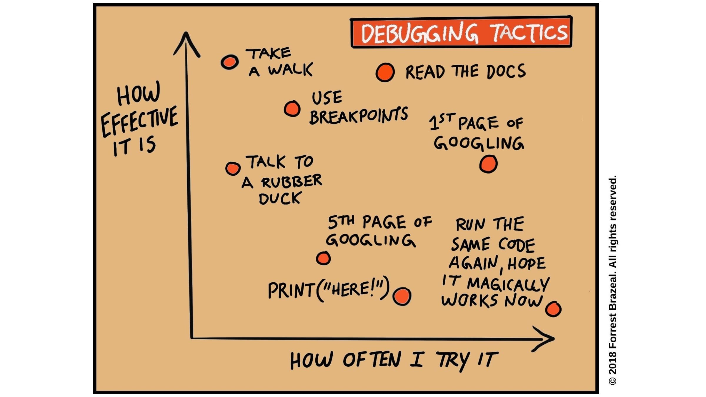

# Debugging

In this workshop, you will practice translating programming skills learned in EdX to a professional setting. You will learn how to use VSCode’s debugger to step through code, and how to build your debugging instincts when working on larger programs.

Debugging is a complicated skill. It's a mix of experience ("I've seen this before ..."), strategies ("I'll try back-tracing this time"), specific knowledge ("This pandas method modifies the data in-place"), patience ("Breath in, breath out, try again") and good habits ("If only I'd written tests!"). You will never know everything about debugging because every project is different. But if you practice good habits, you will be ready to fix new bugs when you find them.

- [Learning Objectives](#learning-objectives)
- [Prep Work](#prep-work)
- [Workshop Outline](#workshop-outline)

---

## Learning Objectives

Priorities: 🥚🐣🐥🐔 (click for more info)

 

Learning objective for this workshop are labeled so you can prioritize your study time. The emojis show the _minimum_ mastery you are expected to achieve for each skill, but there is no maximum! If you have the time you should aim to master all of the skills introduced in this workshop.

- 🥚 You are expected to master these skills. They are the foundations you will need to move forward.
- 🐣 You are expected to be comfortable with these skills. It's ok if you still need help sometimes.
- 🐥 You are expected to be familiar with these skills. It's enough to recognize them in practice and apply them with help.
- 🐔 You are not expected to know these skills, but they are important if you want to excel. You should only focus on these after mastering the 🥚, 🐣 and 🐥 objectives.

---

### VSCode

- 🥚 You can open a folder in VSCode and browse it's contents in the Explorer pane.
- 🥚 You can open a terminal in VSCode and run a Python script.
- 🥚 You can create, rename and delete files and folders in the Explorer pane.

### VSCode Debugger

- 🥚 **Using Breakpoints**:
  - You can add and remove breakpoints, before and while you are debugging a program.
  - You can enable and disable breakpoints without removing them.
- 🥚 **Launching the Debugger**: You can open the debugger pane and launch a single-file Python program.
- **Debugger Buttons**
  - 🥚 **Skip Ahead**: You can skip ahead to the next breakpoint or the end of the program.
  - 🥚 **Step Over**: You can step _over_ a function call to ignore its implementation.
  - 🥚 **Step In**: You can step _into_ a function call to debug it's implementation.
  - 🥚 **Step Out**: You can step _out of_ a function call to resume debugging the main program.
  - 🥚 **Restart**: You can restart your debugger at the beginning of the program.
  - 🥚 **Exiting**: You can exit the debugger at any point of execution.
- 🥚 **Reading State**: At each point in a program's execution, you can find the value of any declared variable in the Variables pane.
- **The Call Stack**:
  - 🥚 You understand the relationship to between the _callstack_ pane, _local variables_ and _function calls_.
  - 🥚 You can view the local variables for each level of the callstack by clicking on it.
- 🐣 **Tracing Recursion**: You can debug a recursive algorithm by tracing through it's callstack in the debugger.
- 🐣 **Variable Categories**: You can explain the difference between _Locals_, _Globals_, _Function Variables_, _Class Variables_, and _Special Variables_
- 🐥 **Watch Expressions**: You can create helpful _watch expressions_ and use them to track information about your program that is not explicitly declared in the code.

### Debugging Mindset & Strategies

- 🦆 You are not embarrassed to do some [rubber duck debugging](https://rubberduckdebugging.com/).
- 🥚 You know that someone else will always use your program [in a way you didn't imagine](https://www.youtube.com/watch?v=CfCiW4UhqLo).
- 🥚 You can study a program skeptically, always asking "_how can I break this program?_".
- 🐣 You can _predict_ a program's behavior while stepping through in the debugger:
  - Which line will execute next?
  - What will change in memory (_callstack_ and _variables_)?
- 🐣 You can identify steps of execution that surprise you. This will help understand the gap between what a program _does_ do, and what it _should_ do.
- 🐣 You can clearly describe a bug by answering these questions:
  - what _should_ the program do? Name specific test cases and lines of code!
  - What _does_ the program do? Name specific test cases and lines of code!
- 🐥 You can trace a program backwards from a surprising step to understand how it happened (either mentally or on paper, VSCode's debugger only goes forward).

### Avoiding Bugs in the Fist Place

> Debugging is twice as hard as writing the code in the first place. Therefore, if you write the code as cleverly as possible, you are, by definition, not smart enough to debug it.
>
> - [Brian Kernighan](https://github.com/dwmkerr/hacker-laws#kernighans-law)

- 🥚 Always use the simplest and most understandable solution. ([KISS](https://github.com/dwmkerr/hacker-laws#the-kiss-principle))
- 🥚 Develop your code one small step at a time, writing and running tests for each change before moving on.
- 🥚 Have others read and review your code, they will find mistakes you missed and think of improvements you wouldn't.
- 🥚 Write less code. Keep your end goal in mind and avoid writing any code that is not _absolutely necessary_ to reach your goal.
- 🥚 Keep a Bug Log; Write down bugs you've encountered and how you fixed them. This log will help you avoid making the same mistakes, and double as inspiration for how to fix new bugs.

---

# Prep Work

How to prepare before the workshop:

- Download this repository to your computer. You can use git if you know how, otherwise you can just [download the code directly](https://sites.northwestern.edu/researchcomputing/resources/downloading-from-github/).
- [Download Visual Studio Code](https://code.visualstudio.com/download).
- Install python on your computer if you have not already.
- Practice [opening a folder in VSCode and running a Python script](https://www.youtube.com/watch?v=197JAS1gNKo).

If you have more time, you can watch the [`/1_stepping_through` guide video](./0_stepping-through/) and practice with the `/0_stepping_through` exercises.

---

## Workshop Outline

### Workshop Overview _(all together)_

> ~10 minutes

The workshop instructor will introduce the main concepts of this workshop:

- Introduce the workshop's [learning objectives](#learning-objectives).
- Demonstrate _predictive stepping_ in a debugger.

### Practice Predictive Stepping _(small groups)_

> ~10 minutes

Have one person in your group share their screen, then practice asking and answering these questions as you study the programs in [/0_stepping_through](./0_stepping_through):

Before each step:

- Which line will run next?
- What will change in memory? (_variables_ and _callstack_!)

After each step:

- Were your predictions correct?
- If now, why? What did you miss when you made your prediction?

### The Debugging Mindset _(all together)_

> ~10 minutes

- Each group will have 1 minute to share:
  - One thing they couldn't understand
  - One interesting thing they learned
- Introduce the next exercises

### Find the Bugs! _(small groups)_

> ~20 minutes

Try to find the bug in each program of [/1_find_the_bugs](./1_find_the_bugs/):

### Discussion & Introduce Next Exercise _(all together)_

> ~10 minutes

- Each group will have 1-2 minutes to share:
  - One thing they couldn't figure out
  - One surprising thing they learned
  - One thing they'd like to discuss with the full class
- Discuss how you approach code differently when you expect it has a bug, and why it's important to always think this way.
- Introduce the next exercises.

### Fix the Bugs! _(small groups)_

> ~20 minutes

Find and fix as many bugs as you can in [/2_fix_the_bugs](./2_fix_the_bugs)!

### Discussion _(all together)_

> ~10 minutes

1. Each group will have 2-3 minutes to share:
   - One thing they couldn't figure out
   - One surprising thing they learned
   - One thing they'd like to discuss with the full class
2. Discuss!
